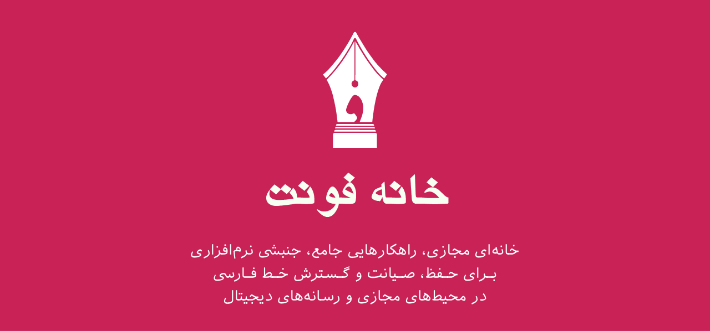
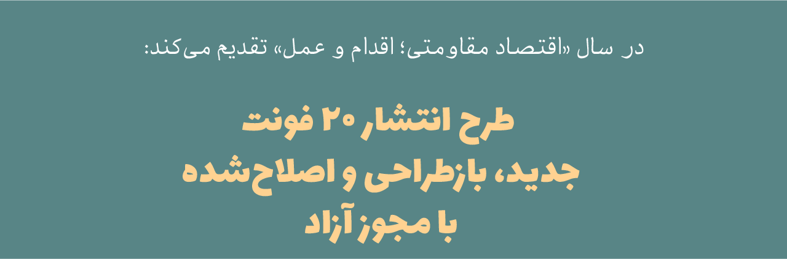
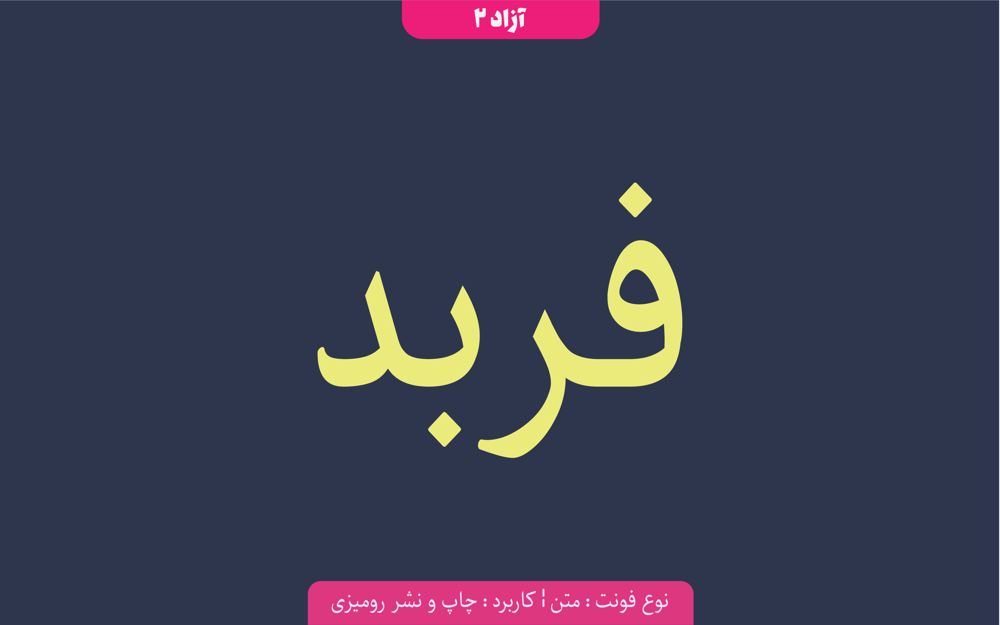
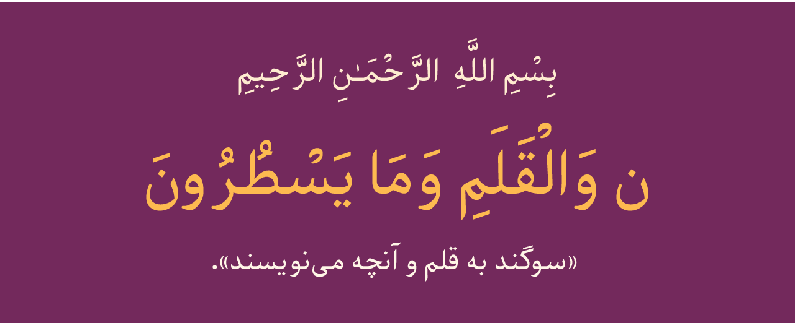
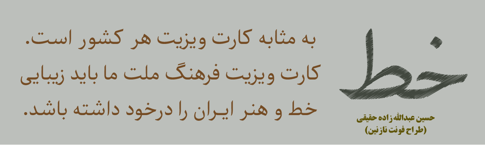
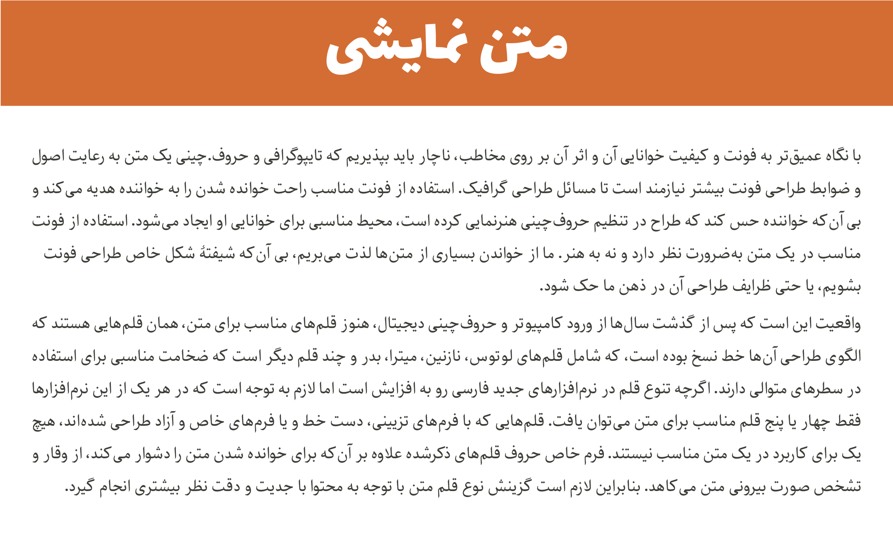
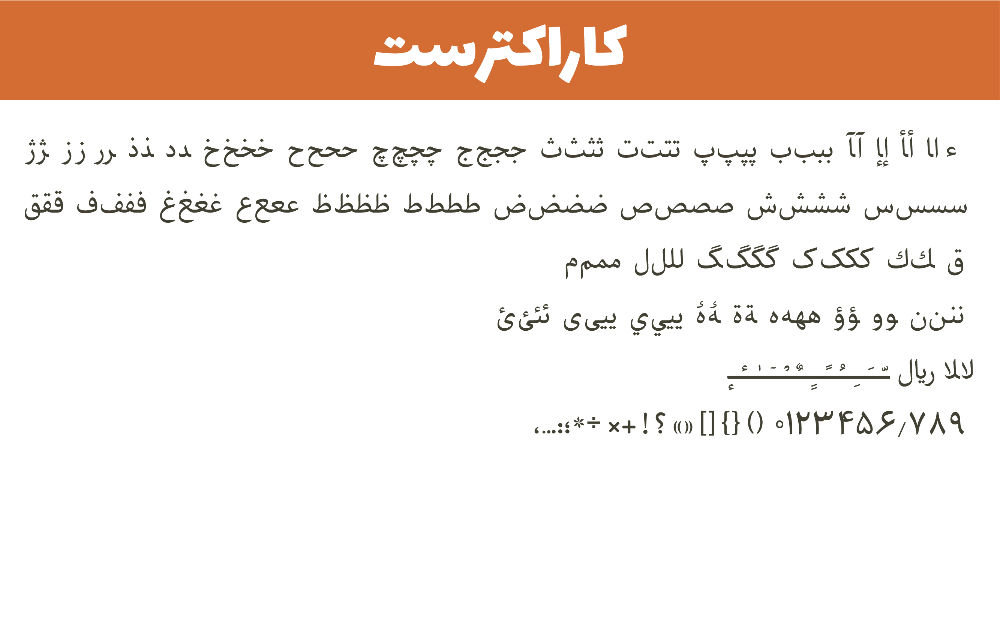

# Nika font project

Farbod is a  Persian/Arabic typeface, suitable for text.

فربد تایپ‌فیس فارسی/عربی برای متن

#نگارش فعلی
 version : v3.0.3   
 demo : [here](http://font-store.github.io/font-farboad/online/)

# سرگذشت

##Farbod 3.0.0 :
 در این نسخه فربد را از نو شروع به طراحی کردم. هدف این فونت فقط چاپ و نشر رومیزی هست. فونت‌های این مورد نیاز به خصوصیات خاص در اشکال حروف دارند. برای مثال دندانه‌ها بسیار ظریف و کوتاه گرفته می‌شود و نزدیک به دستگاه‌های نستعلیق و نسخ عربی/فارسی باید باشد.

 
##Farbod 2.0.0 :
 این نسخه حاضر شده بود، اما در مرحله تکمیل فونت نیکا تصمیم گرفتم هر دو فونت رو باهم ادغام کنم تا فونت نیکا این قابلیت رو پیدا کنه تا سایر سبک‌های دیگه مثل منولاین و منو اسپیس رو  بتواند ساپورت کند.

## Farbod 1.0.0 :
 نسخه آزمایشگاهی  و تست برای تولید پیاده سازی فونت ساز

# درباره فونت
تایپ‌فیس فربد، دومین تایپ‌فیسیی هست که موفق شدم از صفر و بدون پایه(ریدیزیان)  برای خط فارسی طراحی کنم. این تایپ‌فیس هدیه ناقابل من هست به تمامی کودکان فارسی زبان و صد البته هدیه ویژه به جیگر خودم فربد عزیزم.

تایپ‌فیس فربد یک تایپ‌فیس آزمایشگاهی هست. و به این معنی ایست که تمامی نتایجی که طی این چهار سال از پژوهش و تحقیق برروی خط فارسی در رسانه‌های دیجیتال بدست آورده‌ام را روی این تایپ‌فیس به معرض تجربه و آزمایش قرار ‌دادم. برای همین است که نگارش‌های متعدد و متنوعی از این تایپ‌فیس تولید شده. البته تمامی ویرایش‌های قبلی منتفی شده‌اند و نگارش ۳ نسخه اصلی و پایدار این تایپ فیس خواهد بود.

تایپ‌فیس فربد مشت محکمی بر دهان آندسته از هنرمندان مغرور و متکبری ایست که سالها جامعه را در فقر فونت فارسی نگه داشتند تا خودشان را بزرگ جلوه بدهند، کسانی که مدعی دانش و هنری هستند که بسیار دشوار و رمزآلود است و معتقدا هر کسی نمی‌تواند حروف طراحی کند!!! کسانی که به من گفتند ریاضیات هیچ نقشی در در طراحی حروف ندارد.

من با طراحی و پیاده‌سازی فربد به آنها نشان دادم آن دانشی که مدعی‌ آن هستند و از آن صحبت می‌کنند در واقع آنقدر ابتدایی و در مراحل اولیه و پایه‌ای خود قرار دارد که من برنامه‌نویس در کمتر از ۱۵ ماه تحقیق و تلاش شبانه روزی، بدون هیچ‌گونه دانش اولیه مورد نیاز همچون اصول گرافیک یا آشنایی نسبی به اصول خطاطی و خوشنویسی و بدون هیچ راهنمایی یا مشاوره از استادی توانستنم این دانش رمز‌آلود و دشوار را فقط با کمک مهندسی معکوس تجزیه و تحلیل نمایم و آن را قاعده‌مند و مکتوب و مستند سازم. و فربد حاصل همین پژوهش هست.

و اما این چهار سالی که بر من گذشت، هرچند بسیار دردناک و زجرآور سخت بود، اما از آنچه بدست آوردم راضیات کامل دارم و به خودم افتخار میکنم، افتخار می‌کنم که توانستم آن کاری که این هنرمندان متکبر فقط حرفش‌ را می‌زنند و تا این لحظه نتوانستند آن را به یک نتیجه مستند و منسجم برسانند، من موافق شدم آن را قاعده‌مند و تا حدی قانون‌مند و مستند سازم. علاوه بر این‌ راهکار‌هایی هم برای آموزش به دیگران ابداع کردم تا هر کسی که علاقه‌مند به طراحی حروف هست و توانایی‌اش را دارد بتواند با کمترین دانش و تجربه قبلی قادر باشد حروفی درخور هویت خط فارسی طراحی نماید.

# وضعیت توسعه

این فونت در مراحل اولیه طراحی و پیاده سازی قرار دارد و هنوز به حالت پایدار نرسیده است.
در صورت مشاهده هرگونه اشکال لطفا آن را گزارش نمایید.

# برنامه توسعه

از آنجا که فعلا در مرحله طراحی حروف قرار دارد سخت است در مورد آینده توسعه آن صحبت کرد. اما سعی بر این هست که این فونت تا ۴ وزن توسعه پیدا کند.

# حمایت و مشارکت در توسعه فونت نیکا

پروسه و روند توسعه یک فونت کاریست بسیار ظریف و دقیق و بسیار زمان‌بر که میبایست با صبر و حوصله فراوان صورت گیرد. توسعه یک فونت شاید توسط یک شخص یا گروه در ابتدا آغاز گردد، اما در نهایت این فونت باید مورد تایید مصرف کنندگانش قرار گیرید و این به این معنی است که هر فونتی خواسته یا ناخواسته میبایست مخاطبین خود را مورد پوشش قرار داده  و نظرات آنها را دریافت و در تغییرات لحاظ نماید. و این تنها راهی اسیت که میشود به یک فونت فونت خوب و ایدعال دست پیدا کرد.

شما می‌توانید به دو صورت در توسعه این فونت مشارکت یا با ما سهیم شوید:

۱- در ابتدا باید یاد آوری نماییم که فراموش نکنید که این فونت یک پروژه آزاد هست، متعلق به یک شخص و یا گروه خاص نمی‌باشد ویعنی مالکیت عمومی دارد. پس خیلی راحت و بدون هیچ عذر و بهانه‌ای در مورد فونت، چهره حروف  و … نظرات خود را با ما درمیان بگذارید. یا اصلا آستین بالا زده و با ما در بهتر شدن و تکمیل این فونت همکاری نمایید. بنده هیچ ناراحت نمی‌شوم برعکس شدیدا منتظر انتقاد و پیشنهادات شما هستم.

۲- راه دیگر حمایت مالی ایست.خوب میدانید که در شرایط فعلی ایران مخارج زندگی بسیار پر هزینه است، و اینگونه پروژه‌ها نیاز به مشارکت عمومی یا اسپانسر مالی دارد.  شما می توانید با حمایت مالی که در توانتان هست در رسالت «حفظ و صیانت و گسترش خط فارسی در رسانه‌های دیجیتال» با من سهیم شوید تا با هم وبه کمک هم و  همکاری هم از این هویت ملی پاسداری نماییم.

جهت حمایت مالی هم می‌توانید از طریق این [لینک]   (https://www.payping.ir/d/O3ub) اقدام نمایید.

** سیستم جذب حمایت مالی در حال دولوپ شدند هست. متاسفانه فعلا به صورت دستی نتایج حمایت مالی را بروز می‌نمایم.

## بزرگوارانی که فربد رو مورد حمایت خود  قرار دادند:

total(rials) : ۲۵۰۰۰ تومان
total(dollar) : 0$

-   [محمد کیهانی](https://twitter.com/1keyhani)

## Preview

