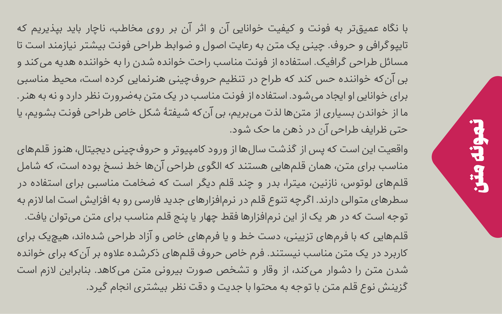
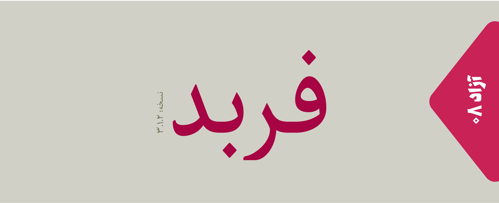
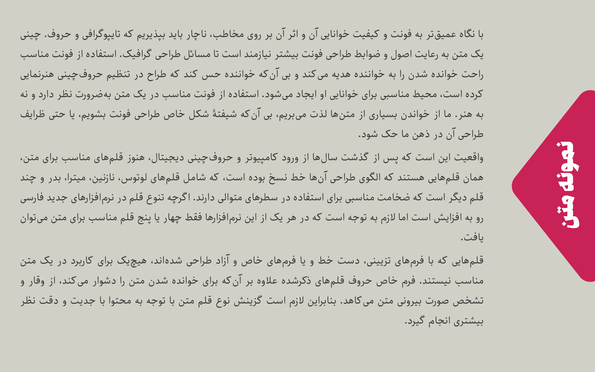
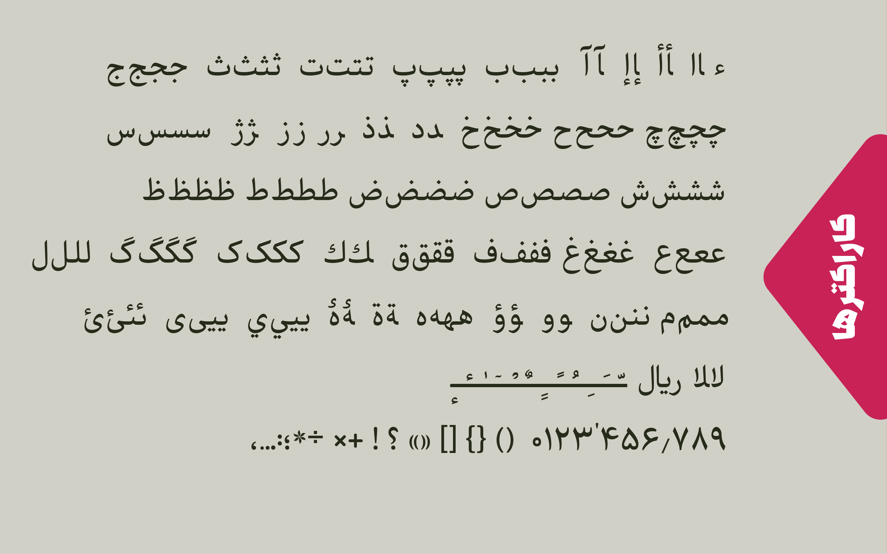

# About

- Name : Farbod 
- Descrption :Farbod is a Persian/Arabic font.
- Designer : [Mohammad Saleh Souzanchi](http://github.com/zoghal)
- Development : [Mohammad Saleh Souzanchi](http://github.com/zoghal)
- Style : Naskh
- Usage : Print & Publishin, High Resolution Screen or More than 18px font size
- Download : [here]()

#  Demo & Tests

- Tecnical Test : [here](http://font-store.github.io/font-farbod/online/)
- Survey 1 : -

# Donation

## بزرگوارانی که فربد رو مورد حمایت خود  قرار دادند:

total(rials) : ۲۵۰۰۰ تومان

total(dollar) : 0$

-   [محمد کیهانی](https://twitter.com/1keyhani)

# Preview

# سرگذشت

##Farbod 3.0.0 :
در این نگارش تایپ فیس فربد مجددا از نو طراحی شده است. فربد قرار هست برای  محیط‌هایی که وضوح بالایی در نمایش دارند استفاده شود، محیط‌های همچون چاپ و نشر رومیزی، و کاربردش بیشتر برای متون رسمی می‌باشد.

اینگونه فونت‌ها ویژگی‌های خاص خودشان را دارند و از نظر چهره و اندازه حروف با سایر فونت‌های دیگر متفاوت هستند. برای مثال:

 - دندانه‌ها بسیار ظریف(لاغر) و و ارتفاع کمتری دارند.
 - در اکثر حروف دور فراوان و سطح کمتر دیده میشود
 - چهره حروف از خط‌های نستعلیق و نسخ عربی/فارسی گرفته می‌شود تا ظاهر رسمی پیدا نماید.

 
##Farbod 2.0.0 :
 این نسخه حاضر شده بود، اما در مرحله تکمیل فونت نیکا تصمیم گرفتم هر دو فونت رو باهم ادغام کنم تا فونت نیکا این قابلیت رو پیدا کنه تا سایر سبک‌های دیگه مثل منولاین و منو اسپیس رو  بتواند ساپورت کند.

## Farbod 1.0.0 :
 نسخه آزمایشگاهی  و تست برای تولید پیاده سازی فونت ساز
